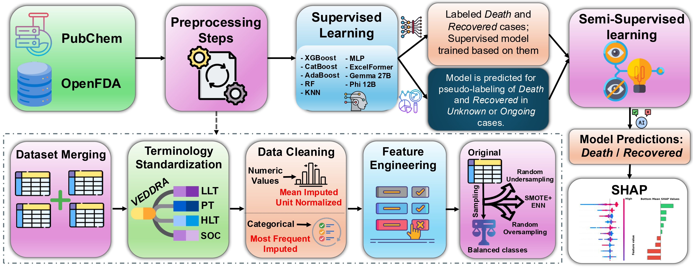

# 
# <div align="center">Predictive Modeling and Explainable AI for Veterinary Safety Profiles, Residue Assessment, and Health Outcomes Using Real-World Data and Physicochemical Properties</div>


<div align="center">
<p>
<a href="https://arxiv.org/abs/2510.01520">Paper</a>
</p>
</div>


## 🔎 Overview



## 🗺️ Roadmap
- [x] Release data curation
- [] Release data preprocessing
- [] Release training models
- [] Release model explainability  

## 📖 Citation

If you find this repository useful, please consider giving a ⭐ or citing our work:

```bibtex
